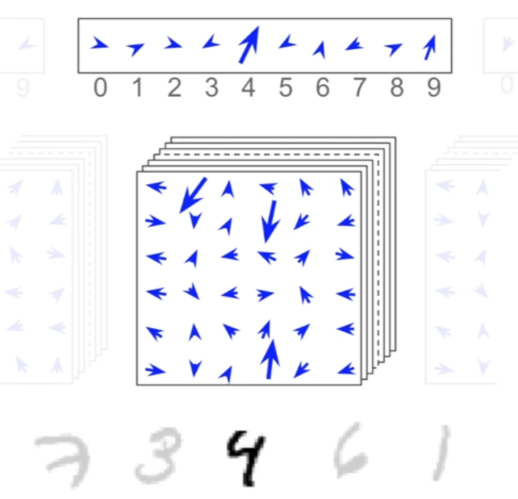
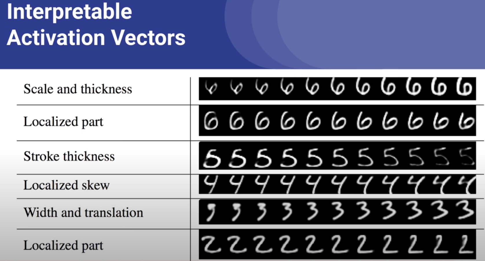

# Meeting Minutes - 2542391s

## Meeting Description

**Date/Time:** 27/10/2023 14:00:00
**Meeting Number:** \#06
**Meeting Location** In-Person

## Progress Made

* Counting Reserach
* Dataset Created

## Questions

* I want to demonstrate that there is some schematic encoding/represenations that goes beyond just a heat map in the capsules outputs.

* Capturing these representations in a more complex environment, to demonstrate visual concept encapsulation.

## Meeting Minutes

14:25 -  

## Meeting Notes

* 

## Action Points

### Action Point 1

* COUNTING research, thats what im investigating

### Action point 1.5

* Encapsulation / Database relationship reserach

### Action Point 2

* Design Network!!!

### Action Point 3

* DATASET TIME