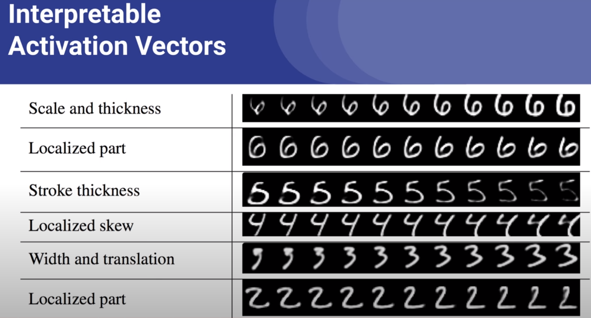

# Meeting Minutes - 2542391s

## Meeting Description

**Date/Time:** 3/11/2023 15:00:00
**Meeting Number:** \#07
**Meeting Location** In-Person

## Progress Made

* Counting Reserach
* Dataset Created

## Meeting Agenda

* I want to demonstrate that there is some schematic encoding/represenations that goes beyond just a heat map in the capsules outputs.

* Capturing these representations in a more complex environment, to demonstrate visual concept encapsulation.

### Dataset

* Multi-MNIST training set, that can be scaled, distribution altered, potenitally could add colour...
* The .zip was corrupted so will need to regenerate but here are some examples

## Whats the plan?

* Create pilot study, using typical CNN methods, to get inital results that will help me contrast and compare. This is mainly so I can get to grips with the framework I choose (depends on capsule network implementation).
* Have a design for the capsule network for nextweek that can be implemented.

## Meeting Minutes

14:55 - Alfie's turn
15:15 - My turn, just checking in with encapsulating of concepts plan.
15:20 - Dissertation advice, write these plans down (encapsulating, scalar acitivites, etc., etc.), adapt plan
15:25 - Paulius' turn
15:45 - Laurie's turn

## Meeting Notes

* Can have git access be public
* Psychophysics characteristics - recognising objects involves precues - don't need exemplars if we precue the capsules with scalars!
* Scalar activations of capsules - how we visualise this "latent space of capsules".

## Action Points

### Action Point 1

* Make git repo public

### Action Point 2

* Adapt plan, write new timeline, tweak reserach proposal to include the evolutional aspects I'm investigating .

### Action Point 3

* Finish pilot study, make sure dataset is viable.

### Action Plan 4

* Designing Capsule Network.
  