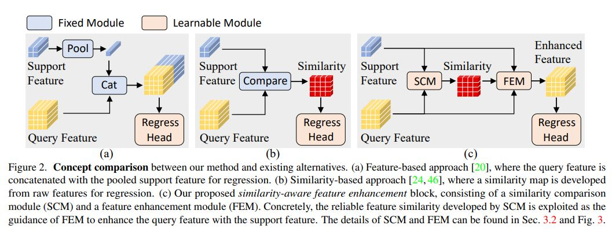

# Papers

* Investigating the Ability of CNNs to Count Visual Concepts
* Fergus Steel
* 2542391s
* Dr. Paul Siebert

Summary of papers read with notes and links.

## Counting and locating high-density objects using convolutional neural networks

<https://www.sciencedirect.com/science/article/pii/S0957417422000549>

* Uses a three stage model to estimate density map that can be used to count objects
* Trained on a dataset of trees
* Feature Map Extraction using standard ConvNet
* Pyramid Pooling Module that concatenates many pooling layer outputs to encode local and global information.
* Multi-Sigma Stages Module that estimates the density map using gaussian kernels around objects, i.e. an object in the training set will have several gaussian kernels applied to it with decreasing s.d. such that the model can predict the likelihood an objects exists at a given location.
* If the peak in the confidence map at the final stage of the MSS module exceeds a threshold then it is counted as an object.
* Experiments found that T=4 was best number of stages in the MSS module as performance decreased past this point as network got deeper.
* The proposed approach was used on the CARPK and PUCPR+ datasets to evaluate its generality, and performed strongly compared to existing methods.
* The method was able to count and locate even partially occluded objects.
* Proposed future work - using difference distribution kernels.

## Focal Loss for Dense Object Detection (RetinaNet)

<https://arxiv.org/pdf/1708.02002v2.pdf>

* Two-Stage (R-CNN) vs One-Stage (YOLO) Object Detectors and their differences are evaluated.
* Two-Stage methods use proposals where a set of candidate locations are suggested and then they are classified in a second stage
* RetinaNet is a one-stage detector that used Focal loss to significantly improve performance.
* Class Imbalance (more background classes) is the main obstacle preventing one stage detectors from outperforming two stage detectors.
* Focal Loss means that the training will focus on hard examples therefore coutneracting class imbalance

## A survey of crowd counting and density estimation based on convolutional neural network

* Researchers have proposed many methods for this task but the main ones are detection-based, regression-based and density estimation.
* Using CNNs in crowd density esimtation works as they have the ability to learn non-linear relations.
* Embedded devices can be unsuitable for CNN architectures as the have many parameters still and require a lot of resources.
* Detection-Based CNN
  * Trained using image dataset annotated by bounding boxes. (locates/detects the people in the input)
* Regression-Based CNN
  * Trained by dataset annotated by point or using unsupervised methods. (Directly estimates the amount of people or the dnesity map).
* Mentions paper that uses LSTMs in crowd counting <https://ieeexplore.ieee.org/document/7780624>
* Domain Adaptation Model - these methods can count in any object domain

## End-to-end people detection in crowded scenes

* Combines RNN and CNN and uses LSTMs as a sort of "controller" that "propogates information between decoding steps and control location of the next output"
* Like Faster R-CNN directly predicts instances of objects (no classification afterwards)
* Related to OverFeat (maybe look into that idk)
* Uses a regression module to generate boxes.
* CNN -> RNN with LSTMs. Each step, LSTM outputs a new bounding box (woah). This stops when LSTM cannot create a bounding box that is above a certain confidence threshold.

## Lightweight convolutionla neural network for counting densely piled steel bars

* Research aimed at developing low cost network that can accurately count DPSB on a handheld device at construction site.
* Were able to reduce numer of parameters and computation cost by 76.86% and 44.82% respectively.
* 66 fps, 99.25% F1 Score.
* Used YoloV5 as backbone of network for high speed, high accuracy.
* "Modern object detector is usually composed of... a backbone for feature extraction, a neck for fusing feature maps of different scales, several heads for outputting detection information."
  * This is in-line with the density estimator paper that used a CNN for feature extraction, a PPM for the fusing of feature maps and the MSS for estimating the confidence maps.

## Feature Pyramid Networks for Object Detection

<https://arxiv.org/pdf/1612.03144.pdf>

* Building feature pyramid networks that represent the features of an input image in a hierarchical pyramid that is constructed through a bottom-pathway and a top-down pathway which are connected via lateral connections
* Bottom-Up Pathway is feedforward computation, where the feature maps are computed at several different scales (filter size / strides). Each stage of the network may have many layers, the last of which is the feature map used in the lateral connections (deepest map at each stage should have the strongest features)
* Top-Down Pathway is the stage-by-stage upscaling the semantically strong feature maps in order to encode locality. Uses nearest-neighbour upsampling by default
* Lateral connections adds the Bottom-Up (1x1 convolved) and the upsampled feature map together to combine this information. 
* Trained on trainval35k COCO dataset (seems like a reasonable size for what I want to do?)

## Learning Long-Term Dependencies in NARX Recurrent Neural Networks

* Gradient-Descent Learning Algoirhtms perform poorly on tasks that involve long-term dependencies. This is lessened in the NARX RNN architecture.
* This class of architectures have been shown to be well suited for modelling nonlinear systems (heat exchangers, time series, etc.)
* A system storing information over time (i.e. a model learning) needs to be robust to noise and this is accomplished if the states exist in the reduced attracting set of the hyperbloic attractor. **i.e the eigenvalues of the Jacobian are contained within the unit circle.** When this requirement is not satisfied we get a formal definition of the vanishing gradient problem.
* In complex systems like crowd-counting could this improve accuracy???

## Analyzing and Exploiting NARX RNNs for Long-Term Dependencies

* Introduces MIST-RNN that better handle vanishing-graident problem, are more efficient, and improve performance on problems with very long-term dependencies.

## Predicting Surgical Phases using CNN-NARX Neural Network

* Using CNN_NARX to implement spatial and temporal information to improve accuracy (doesnt work but cool)
* Output of CNNs are fed into NARX architecture for predictions
* CNNs were trained independently on dataset.
* This paper finds that the NARX netowrk needs additional systems, which is feasible in the capacity I'm thinking about using it (passing output from Crowd Counting CNN)

## CNN-Based Deensity Estimation and Crowd Counting: A Survey

* This paper surveyed over 220 works to study crwowd counting models, mainly density-map estimation methods.

## Accurate few-shot object counting Hough matching feature enhancement

* Well learned model for class-specific object counting only handles certain category covered in training.
* Proposes Few-shot object counting (FSC) that inspired by human abvility to quickly generalise new concepts
* FSC has two stages, feature extracting and matching.
* Hough transform used for rigid object matching.
* HMFENet for FSC proposed: uses Hough matching to get similarity map between exemplares I_E and the query image I_Q.
  * Backbone CNN -> Local Self-Attention to refine it -> Exemplar feature aggregation module to enhance.
  * Secondly, the learnable Hough Matching module outputs similarity maps.
  * Finally fed to counter module that outputs a density map.
* **ResNet trained on ImageNet used as backbone feature extractor!!!** 

## Learning to Count Everything

* Introduces FamNet that inspired paper above and below.
* FSC to solve generability problem
* Introduces dataset on https://github.com/cvlab-stonybrook/LearningToCountEverything
* density map estimation needs millions of annotations on thousands of images which is cost/labour intensive process.
* In FSC the inputs for the coutning task are an image and a few examples of the same image for the object of interest.
*  FamNet has two key components: 1) a feature extraction module, and 2) a density prediction module.
* density estimation do not have to commit to binary decisions so deal better with occlusion.
* **First four blocks from ResNet pre-trained on ImageNet used as backbone feature extractor!!! (these blocks are frozen during training)** 
* "The density prediction module consists of five convolution blocks and three upsampling layers placed after the first, second, and third convolution layers. The last layer is a 1×1 convolution layer, which predicts the 2D density map. The size of the predicted density map is the same as the size of the input image."
* "To train FamNet, we minimize the mean squared error between the predicted density map and the ground truth density map." This is pretty standard and what I implemented in the laptop killer 
* 

## Few-shot Object Counting with Similarity-Aware Feature Enhancement

* A popular solution to FSC is to first represent both the exemplar object (i.e. the support image) and the query image with expressive features, and then pinpoint the candidates via analyzing the feature correlation
* Good description of what we are actually doing: "In FSC, object classes are divided into base classes Cb and novel classes Cn, where Cb and Cn have no intersection. For each query image from Cb, both a few support images and the ground-truth density map are provided. While, for query images from Cn, only a few support images are available."
* Main takeaway from this paper is their "Similarity-aware feature enhancement module" - **see paper for more information** its complex but fantastic

## Zero-Shot Object Counting

* This is sort of a follow on paper from the FSC papers discussed above, but uses exampler generators (cool)
* Again focused on *class agnostic counting* 
* Having bounding boxes for the exemplar images is not practical for real world system.
* Exempler free is proposed in Ranjan et al with RepRPN (read this) - Viresh Ranjan and Minh Hoai. Exemplar free class agnostic counting (only works for images with single dominant object for counting)
* Problem is two-fold, how to localize patches that contain the object of provided class name and how to select good exmeplars.
* Model is trained to measure teh goodness of an input patch based on its corresponding feature map. - "Viresh Ranjan and Minh Hoai. Exemplar free class agnostic
counting. "Specifically, given an arbitrary patch and a pre-trained exemplar-based object counter, we train this model to predict the counting error of the counter when using the patch as the exemplar"
* Use the FSC-147 dataset
* Can count multiple classes.

## Panoptic Segmentation Computer Vision Research

Panoptic Segmentation combines Semantic Segmentation and Instance Segmentation such that an input image can be contextualised into masks of instances of objects that are each classified+located i.e. aims to create universal solution to instance/semantic/panoptic segmentation tasks.

### Masked-Attention Mask Transformer for Universal Segmentation

* Whilst Universal Architectures show state-of-the-art results in segmentation tasks, their performance lacks behind specialized architectures, they are also harder to train.
* This paper builds upon a "meta architecture" of a backbone feature extractor, a pixel decoder and a Transformer decoder
* Pixel decoder sounds like the Top-Down stage of the FPN (oh thats literally what is used in the MetaArchitecture MaskFormer)

### Mask Dino: Towards a Unified Transformer-based Framework for Object Detection and Segmentation

This paper is presents the state of the art Panoptic Segmenter

## Spatio-Temporal Papers

These are some of the papers I found covering similiar research to my idea. <https://conradsanderson.id.au/pdfs/ge_temporal_fine_grained_classification_dicta_2016.pdf>, <https://openaccess.thecvf.com/content_ICCV_2017/papers/Zhang_FCN-rLSTM_Deep_Spatio-Temporal_ICCV_2017_paper.pdf>, <https://arxiv.org/abs/1707.07890#:~:text=To%20exploit%20the%20otherwise%20very%20useful%20temporal%20information,method%20fully%20captures%20both%20spatial%20and%20temporal%20dependencies.>

### Deep Spatio-Temporal Neural Networks for Vehicle Counting in City Cameras

* FCN-rLSTM stacks CNNs to output density maps of each frame which are fed into LSTMs as series.
* "However, no existing work models the spatio-temporal correlation for object counting"
* Density maps used to avoid tracking individual vehicles as this improves performance (especially in low spatial/temporal resolutions (low res, low fps))
* Leverages the strengths of the FCN for pixel-level prediction and strengths of LSTM for learning complex temporal dynamics.
* Residual connections used to speed up training by 5x
* The density maps are reshaped into a 1D vector, which is fed into three LSTM layers with 100 hidden units. After the LSTM unitts they are fed into a single Dense layer which is summed with the density map (residual connection)
* Uses the typical density map ground truths, gaussian kernels applied to centre point of the bounding box.
* Two loss fucntions for each stage, final loss funtion is (loss of density map estimation) + lambda*(loss of global count) where lambda is a tunable hyper parameter
* See (Algorithm 1) in this paper for training algorithm.
* Restriccted by the avilable memory;

### Spatiotemporal Modeling for Crowd Counting in Videos

* Demonstrated that including temporal information improves crowd counting in videos.
* Incorporating temporal information can boost accuracy in compex scenes as it allows  a model to capture motion information.
* ConvLSTM ot a stack like previous paper, if you remove the residual connections between frames, the architecture is really just a FCN with gates. (ConvLSTM-nt, model in this paper).
  * This model actually does outperform other crowd counting methods on the UCF_CC_50 dataset (images not videos) showing that the model is effective even without incorporating the temporal information. 
* Extends ConvLSTM to be birdirectional. Meaning long-range information is captured in both. This architecture consistely outperforms the unidirectional version.
* On the UCSD and Mall datasets which consist of video data, ConvLSTM-nt does outperform other methods but is superseceeded by first the ConvLSTM then by the Bidirectional ConvLSTM.
* These methods (convLSTMs) also respond well to transfer learning. Outperforms other methods on Mall dataset after being trained on UCSD dataset (plus 50 Mall frames for adaptation)

### Exploiting Temporal Information for DCNN-based Fine-Grained Object Classification

* NOTE: Fine-grained classification is where you are classifing between classes in a sub-category of objects e.g. which breed is this dog
* Uses dataset of videos of birds, which are not static
* Seperate CNNs for spatial and temporal features, then combined via Co-Occurrence Encoding module.
* Moving camera shows drop in accurac (unsuprisingly)

### A Spatio-Temporal Attentive Network for Video-Based Crowd Counting

* "Only a bunch of works take advantage of temporal
consistency in video sequences. In this work, we propose a spatiotemporal attentive neural network to estimate the number of pedestrians from surveillance videos. By taking advantage of the temporal correlation between consecutive frames, we lowered state-of-the-art count error by 5% and localization error by 7.5% on the widely-used FDST benchmark." - I thought of this independently!

## The use of NARX Neural Networks to predict Chaotic Time Series

* Exogeneous fatures are time-independent values in a time series.
* "Neural Networks are powerful when applied to problems whose solutiosn require knowledge which is difficult to specify, but for which there is an abundance of examples"
* Long time depencies are a problem due to vanishing gradient
* A long memory process is where a value at a time is correlated to a value at a time in the future.
* "Learning is more effective in NARX networks (i.e. gradient descent is better)"
* "These networks converge much faster and generalize better than other networks."
* NARX networks are implemented by usng a feedforward NN with the embedded memory plus a delayed connexion from the second layer to the input.
* This paper proposes a dynamic back-propogation algorithm.
* training process hs difficulties; Large number of parameters, "overtraining/overfitting". A solution to these problems is penalizing the parameter increase.
  * This is Bayesian Regularization which balances the Squared errors and the weights and then determines the best combination.
* The Levenberg-Marquardt training algorithm is used. 

## Capsule Nets

### G. Hinton "What is wrong with convolution neural networks."

* A capsule does coincidence filtering, when it finds a cluster of predictions it outputs a high probabiltiy that an entity of its type exists in its domain, and the center of that cluster.
* High-dimension coincidences dont really happen.
* Pooling-Layers lose information fundamentally, its a disaster that they work so well as its going to be hard to get rid of.
* Without max-pooling, convnets have equivariance.
  * Place-coded equivariance is where as a low-level part moves to a very different position it is represented by a different capsule (different neurons)
  * Rate-coded equivariance is where as you move a part around the same neurons are encoding but their acitvities are changing.
* Capsule nets, only deal with one instance at a time (uh oh)

## Dataset Ideas

* https://sutdcv.github.io/Animal-Kingdom/Animal_Kingdom/pose_estimation/README_pose_estimation.html !
* https://paperswithcode.com/dataset/mot17 !!